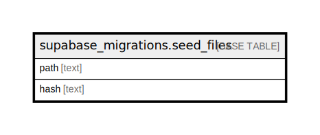

# supabase_migrations.seed_files

## Description

## Columns

| Name | Type | Default | Nullable | Children | Parents | Comment |
| ---- | ---- | ------- | -------- | -------- | ------- | ------- |
| path | text |  | false |  |  |  |
| hash | text |  | false |  |  |  |

## Constraints

| Name | Type | Definition |
| ---- | ---- | ---------- |
| seed_files_pkey | PRIMARY KEY | PRIMARY KEY (path) |

## Indexes

| Name | Definition |
| ---- | ---------- |
| seed_files_pkey | CREATE UNIQUE INDEX seed_files_pkey ON supabase_migrations.seed_files USING btree (path) |

## Relations

---

> Generated by [tbls](https://github.com/k1LoW/tbls)
