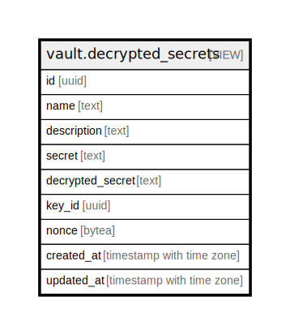

# vault.decrypted_secrets

## Description

<details>
<summary><strong>Table Definition</strong></summary>

```sql
CREATE VIEW decrypted_secrets AS (
 SELECT id,
    name,
    description,
    secret,
    convert_from(vault._crypto_aead_det_decrypt(message => decode(secret, 'base64'::text), additional => convert_to((id)::text, 'utf8'::name), key_id => (0)::bigint, context => '\x7067736f6469756d'::bytea, nonce => nonce), 'utf8'::name) AS decrypted_secret,
    key_id,
    nonce,
    created_at,
    updated_at
   FROM vault.secrets s
)
```

</details>

## Columns

| Name | Type | Default | Nullable | Children | Parents | Comment |
| ---- | ---- | ------- | -------- | -------- | ------- | ------- |
| id | uuid |  | true |  |  |  |
| name | text |  | true |  |  |  |
| description | text |  | true |  |  |  |
| secret | text |  | true |  |  |  |
| decrypted_secret | text |  | true |  |  |  |
| key_id | uuid |  | true |  |  |  |
| nonce | bytea |  | true |  |  |  |
| created_at | timestamp with time zone |  | true |  |  |  |
| updated_at | timestamp with time zone |  | true |  |  |  |

## Referenced Tables

| Name | Columns | Comment | Type |
| ---- | ------- | ------- | ---- |
| [vault.secrets](vault.secrets.md) | 8 | Table with encrypted `secret` column for storing sensitive information on disk. | BASE TABLE |

## Relations



---

> Generated by [tbls](https://github.com/k1LoW/tbls)
